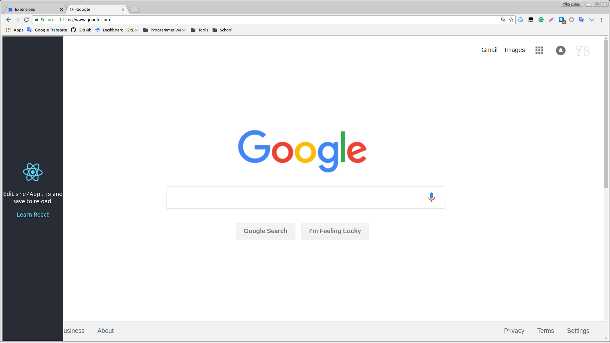

# chrome-sidebar-demo

This project was deprecated, you can have a look at the new project: https://github.com/DaniuTeam/Work_Siderbar

___

### usage

```
yarn
yarn build
```

Then, load extension from this `build` folder.

After you move your mouse to the left of your webpage, you'll see what you should see.

___

### dev

```
yarn
yarn start
```

Then, edit js files in `src` folder
___

### screenshot


